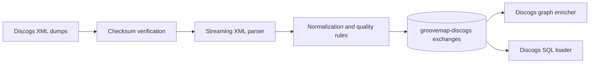

# GrooveMap Discogs ingestion

`discogs-ingestion` downloads, verifies, parses, and normalizes Discogs XML dumps,
then publishes versioned catalog events to RabbitMQ. This repository owns the Discogs
producer, its data-quality rules, event contract, generated bindings, fixtures, state
markers, container image, tests, and release artifacts.



The service publishes artists, labels, masters, and releases. It runs independently
from MusicBrainz ingestion and neither coordinates nor shares a runtime lock with it.

## Development

```bash
mise install
just setup
just check
```

Use `just contract` after changing `contracts/catalog-events/definitions/discogs.json`.
`just image` builds `discogs-ingestion:local`; `just release-dry-run` prepares local
release evidence without publishing, tagging, or pushing.

`just image` is not part of `just check` — the reusable CI already builds the image on
every push. Run `just image` yourself whenever you touch a compile-time `include_str!`
(e.g. the vendored media taxonomy under `contracts/catalog-events/vocab`) or anything
else the Docker build context depends on, since `just check` alone won't catch a missing
`COPY`.

## Telemetry

The extractor pushes OpenTelemetry metrics over **OTLP/HTTP-protobuf** to the collector.
There is no Prometheus scrape endpoint for these metrics, and the JSON `/health`,
`/metrics`, `/ready`, and `/trigger` endpoints are unchanged — they remain part of the
service's HTTP contract. Only standard OTEL environment variables are read; there are no
GrooveMap-specific telemetry variables.

| Variable | Effect |
| --- | --- |
| `OTEL_EXPORTER_OTLP_ENDPOINT` | Collector base URL, e.g. `http://otel-collector:4318`. **Unset disables metrics entirely.** |
| `OTEL_EXPORTER_OTLP_METRICS_ENDPOINT` | Per-signal override of the base URL. |
| `OTEL_METRICS_EXPORTER` | `otlp` (default) or `none` to disable export. |
| `OTEL_SERVICE_NAME` | `service.name`; the compose service key, e.g. `extractor-discogs`. Defaults to `discogs-ingestion`. |
| `OTEL_RESOURCE_ATTRIBUTES` | Extra resource attributes, e.g. `service.namespace=groovemap,deployment.environment.name=dev`. |
| `OTEL_METRIC_EXPORT_INTERVAL` | Export period in milliseconds; the SDK default is 60000. |

`service.version` is always set from the crate version, and the `source` attribute on every
domain metric is the constant `discogs`.

Telemetry never fails startup: with no endpoint configured the bootstrap logs once and
installs a no-op meter provider. Export runs on a periodic reader off the extraction path,
and the final export is flushed on shutdown.

Instruments emitted:

| Instrument | Kind | Attributes |
| --- | --- | --- |
| `groovemap.extraction.records` | counter | `source`, `entity` |
| `groovemap.extraction.files` | counter | `source`, `outcome` |
| `groovemap.extraction.file.progress` | gauge (0..1) | `source`, `entity` |
| `groovemap.extraction.download.bytes` | counter (`By`) | `source` |
| `groovemap.extraction.publish.confirm.duration` | histogram (`s`) | `source` |
| `groovemap.extraction.errors` | counter | `source`, `stage` |
| `messaging.client.sent.messages` | counter | `messaging.system`, `messaging.destination.name` |
| `groovemap.pipeline.reconnects` | counter | `system` |

Runtime instruments are observable: the SDK reads them on the exporter's own thread at
collection time, so nothing on the extraction path pays for them. The `process.*` family
reads `/proc/self` and needs no extra crate; off Linux those four instruments are not
registered at all, so the series is absent rather than a misleading zero. The tokio gauges
use only the stable `RuntimeMetrics` accessors — nothing behind `--cfg tokio_unstable`.

| Instrument | Kind | Attributes |
| --- | --- | --- |
| `process.cpu.time` | counter (`s`), Linux only | `cpu.mode` (`user`, `system`) |
| `process.memory.usage` | gauge (`By`, RSS), Linux only | — |
| `process.thread.count` | gauge, Linux only | — |
| `process.open_file_descriptor.count` | gauge, Linux only | — |
| `groovemap.runtime.tokio.workers` | gauge | — |
| `groovemap.runtime.tokio.alive_tasks` | gauge | — |
| `groovemap.runtime.tokio.global_queue_depth` | gauge | — |

See the [documentation index](docs/README.md) and the [contract guide](contracts/catalog-events/README.md).
The project is licensed under the [MIT License](LICENSE).
