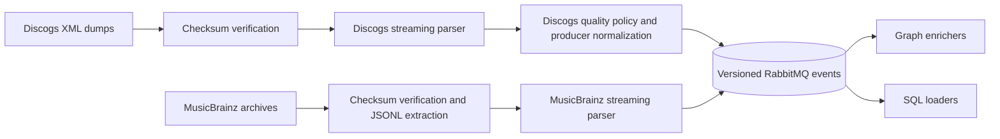

# GrooveMap catalog ingestion

`catalog-ingestion` downloads, verifies, parses, and normalizes Discogs and MusicBrainz
catalog dumps, then publishes versioned events to RabbitMQ. This repository owns the
producer behavior, event schemas, generated Rust and Python bindings, extraction policy,
source-state markers, and the `catalog-ingestion` container image.

## Data flow



Discogs publishes artists, labels, masters, and releases. MusicBrainz publishes artists,
labels, release groups, and releases. Consumer repositories promote the contract from
[`contracts/catalog-events/v1`](contracts/catalog-events/v1/) and verify its digest
without importing this repository's source.

## Development

The pinned toolchain is declared in `.mise.toml`.

```bash
mise install
just setup
just check
```

The stable repository interface includes:

- `just check` — run formatting, lint, tests, contract generation checks, build checks,
  repository policy, license policy, secret scanning, and a version preview.
- `just test` — run the Rust test suite.
- `just contract` — regenerate the event contract and language bindings.
- `just contract-check` — prove generated artifacts match committed sources.
- `just image` — build the `catalog-ingestion:local` container image.
- `just release-dry-run` — produce release evidence without tagging or publishing.

Run `cargo run --locked -- --help` for source selection and runtime options. Runtime
credentials, volumes, service topology, image deployment, and mounting the
source-controlled extraction-rules file belong to the `deployment` repository. The
rules file is not baked into the container image or release bundle.

The product, repository, health-service, and container-image identity is
`catalog-ingestion`. A small set of executable, Compose-network, environment, and
RabbitMQ names remains stable for compatibility; these are cataloged in [Runtime identity
and compatibility](docs/runtime-identity.md).

## Documentation

See the [documentation index](docs/README.md) for source pipelines, extraction rules,
state-marker behavior, runtime identity, and maintained architecture decisions. The [contract
guide](contracts/catalog-events/README.md) describes compatibility and promotion.

## Release and license

The crate and container are independently versioned from `Cargo.toml`. Approved
`v*` tags are the only publishing boundary. Local release recipes never commit, tag,
push, publish, or create a release.

The current tree is licensed under the [MIT License](LICENSE). Historical source
attribution remains available in Git history.
