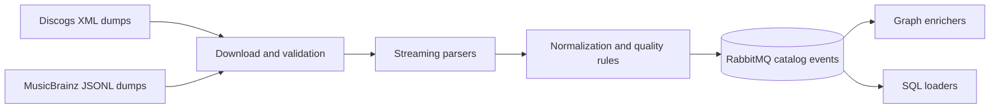

# GrooveMap catalog ingestion

Rust service that downloads, validates, parses, and normalizes Discogs and MusicBrainz
catalog datasets, then publishes versioned events to RabbitMQ. This repository owns the
producer contract, generated Rust and Python bindings, extraction rules, source-state
markers, and the `catalog-ingestion` container image.

## Data flow



The producer publishes to source-specific exchanges. Consumer repositories promote the
versioned contract from [`contracts/catalog-events/v1`](contracts/catalog-events/v1/)
and verify its digest without importing this repository's source.

## Development

The pinned toolchain is declared in `.mise.toml`.

```bash
mise install
just setup
just check
```

The stable repository interface includes:

- `just check` — run formatting, lint, tests, contract generation checks, build checks,
  repository policy, license policy, secret scanning, and a version preview.
- `just test` — run the Rust test suite.
- `just contract` — regenerate the event contract and language bindings.
- `just contract-check` — prove generated artifacts match committed sources.
- `just image` — build the `catalog-ingestion:local` container image.
- `just release-dry-run` — produce release evidence without tagging or publishing.

Run the binary with `cargo run -- --help` for source selection and runtime options.
Credentials and deployment topology belong to the `deployment` repository.

## Documentation

See the [documentation index](docs/README.md) for extraction rules, state-marker behavior,
and the seven migrated extractor plan/spec pairs. The
[contract guide](contracts/catalog-events/README.md) describes compatibility and
promotion.

## Release and license

The crate and container are independently versioned from `Cargo.toml`. Approved
`v*` tags are the only publishing boundary. Local release recipes never commit, tag,
push, publish, or create a release.

The current tree is licensed under the [MIT License](LICENSE). Historical source
attribution and extraction details remain in retained design records and Git history.
