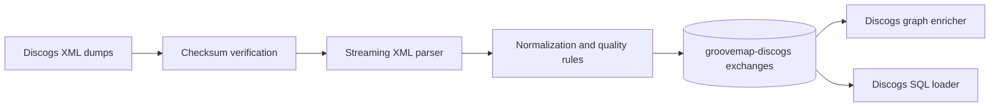

# GrooveMap Discogs ingestion

`discogs-ingestion` downloads, verifies, parses, and normalizes Discogs XML dumps,
then publishes versioned catalog events to RabbitMQ. This repository owns the Discogs
producer, its data-quality rules, event contract, generated bindings, fixtures, state
markers, container image, tests, and release artifacts.



The service publishes artists, labels, masters, and releases. It runs independently
from MusicBrainz ingestion and neither coordinates nor shares a runtime lock with it.

## Development

```bash
mise install
just setup
just check
```

Use `just contract` after changing `contracts/catalog-events/definitions/discogs.json`.
`just image` builds `discogs-ingestion:local`; `just release-dry-run` prepares local
release evidence without publishing, tagging, or pushing.

See the [documentation index](docs/README.md) and the [contract guide](contracts/catalog-events/README.md).
The project is licensed under the [MIT License](LICENSE).
