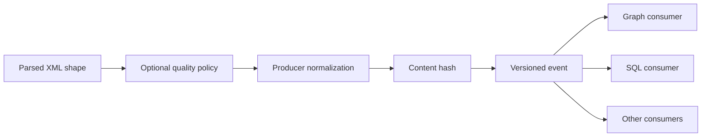

# ADR 0001: Normalize at the producer boundary

- Status: accepted
- Scope: Discogs event payloads

## Context

Discogs XML parses into a source-shaped JSON tree with attribute prefixes, text wrappers,
and single-item containers. Normalizing that tree independently in every consumer
duplicates work and allows consumer payload shapes and hashes to diverge. The optional
rules engine also cannot be allowed to decide whether normalization occurs.

## Decision

Normalize Discogs records once in `catalog-ingestion`, after optional skip/filter/rule
evaluation and before batching. Compute `sha256` from the normalized payload. The
normalizer is an unconditional pipeline stage, including when `DATA_QUALITY_RULES` is
unset.

Rules retain source-shaped paths such as `genres.genre`, so observation happens before
normalization. Normalization then flattens entity collections, removes XML attribute and
text wrappers, and gives every consumer the same contract payload.

## Consequences

- Consumers perform storage-specific projection and type conversion, not generic XML
  shape cleanup.
- Content hashes represent the published form and remain consistent whether rules are
  enabled or disabled.
- Changing normalization changes published payloads and hashes; it requires contract
  compatibility review and an idempotent consumer rollout.
- MusicBrainz uses a source-specific JSONL parser that already creates its published
  shape; this Discogs normalization stage is not applied to MusicBrainz records.
