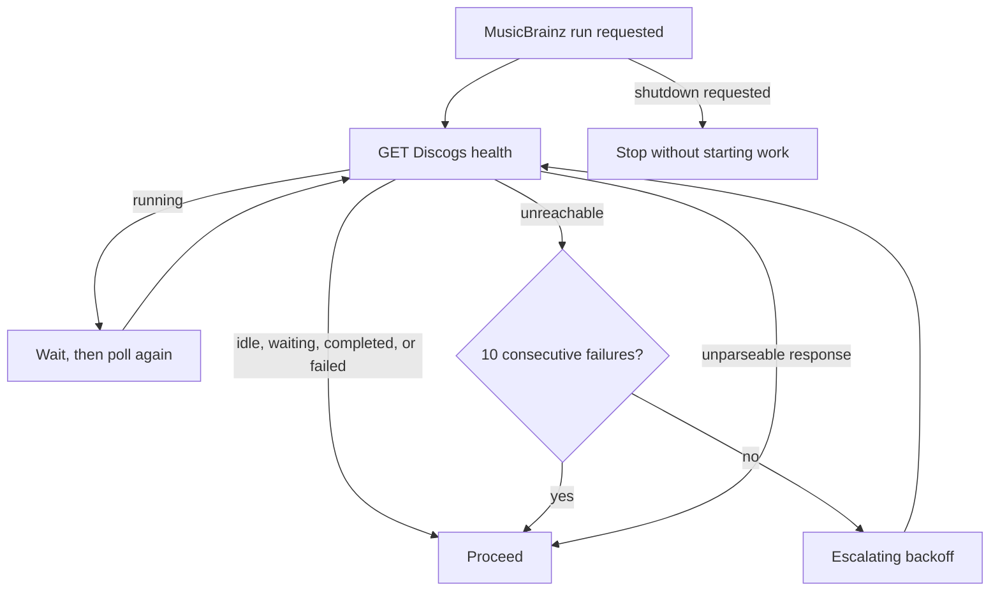

# ADR 0002: Coordinate MusicBrainz behind Discogs

- Status: accepted
- Scope: current combined-runtime source-loop scheduling

## Context

Discogs and MusicBrainz extraction can each consume substantial network, disk, broker,
and downstream capacity. MusicBrainz events also carry cross-references intended to
enrich Discogs-derived catalog entities, so starting both source runs together creates
avoidable contention and ordering ambiguity.

## Decision

Before every initial, periodic, or triggered MusicBrainz run, poll the Discogs
extractor's health endpoint configured by `DISCOGS_HEALTH_URL`.

A healthy `running` response is polled at the production busy interval. An unreachable
endpoint retries ten times with an escalating delay beginning at five seconds and capped
at five minutes, then proceeds so a deliberately absent Discogs service cannot block
MusicBrainz forever. An unparseable health response also proceeds immediately. All waits
are shutdown-aware. This is a fail-open scheduling preference: it neither guarantees
Discogs-before-MusicBrainz publication nor provides distributed mutual exclusion.

## Consequences

- Discogs source publication gets priority while its health signal is reachable and
  parseable; fail-open paths can still allow simultaneous peak load.
- This coordinates producers only. It does not wait for consumer queues to drain.
- The health endpoint is advisory rather than a distributed lock; fallback availability
  is preferred over permanent exclusion.
- Redis locks and broker signaling would add infrastructure and failure modes for a
  two-process scheduling preference. Shared-volume lock files couple deployment storage
  and are not used.
- The implementation belongs to a removable MusicBrainz combined-runtime compatibility
  module, not to shared runtime policy.
- Provider-owned Discogs and MusicBrainz containers do not carry this preference forward:
  after identity cutover they may ingest concurrently without cross-container health
  polling, ordering, or mutual exclusion.
