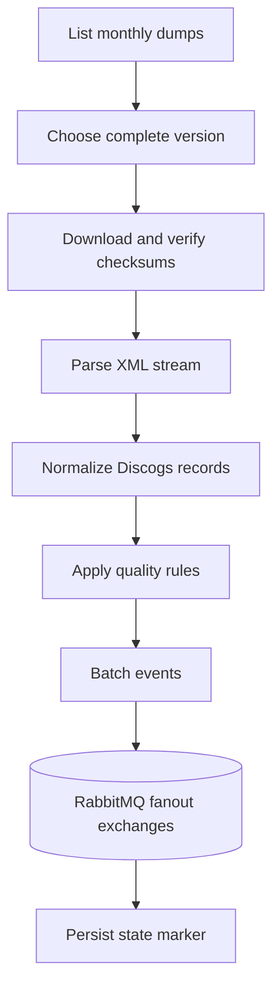

# Discogs extraction architecture

`discogs-ingestion` has one composition root and one provider mode. It discovers the
latest complete monthly Discogs dump set, verifies published checksums, streams the XML,
normalizes records, applies optional quality policy, and publishes batched events.

The default data root is `/discogs-data`. `PERIODIC_CHECK_DAYS` controls subsequent
checks; `DISCOGS_EXCHANGE_PREFIX` defaults to `groovemap-discogs`. Manual triggers and
shutdown remain local to this service. No MusicBrainz health endpoint, ordering rule,
or shared lock participates in a run.
