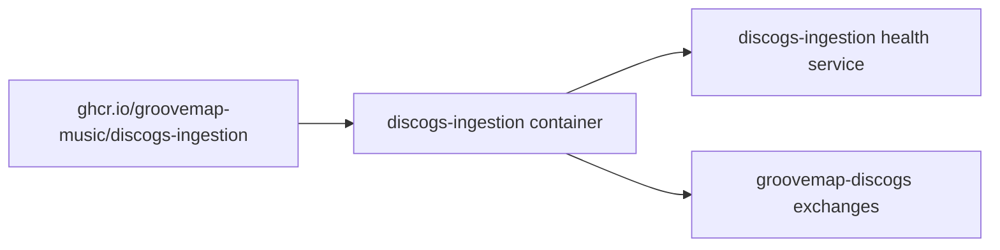

# Runtime identity

The repository, package, container image, release artifact, health service, and startup
banner use `discogs-ingestion`.

The executable is `discogs-ingestion`. Deployment may retain a provider-specific Compose
service name, but there is no combined `catalog-ingestion` runtime and no cross-provider
health dependency. RabbitMQ exchange and queue names remain wire-compatible.
